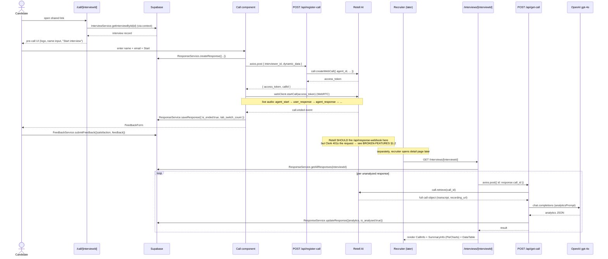

# JOURNEY-MAP.md

> Audit: index-and-audit-platform · Source: cgc manifest, fetched 2026-05-18 · Read-only · Audit version: 1.0

Every route under `src/app/`, with current auth gate, side effects, and linked components. Includes Mermaid happy-path diagrams for the two main user journeys and a catalog of missing surfaces that change #3 should address.

---

## §1 Route table — page routes

| URL pattern | File | Auth gate | Side effects | Linked components | Purpose |
|---|---|---|---|---|---|
| `/` | (no `page.tsx`) | n/a | redirect via `next.config.js` (if configured) — likely 404 on direct hit | — | **MISSING ROOT ROUTE** — see §5 |
| `/sign-in/[[...sign-in]]` | `src/app/(client)/sign-in/[[...sign-in]]/page.tsx` | public (matches `/sign-in(.*)`) | none | Clerk `<SignIn />` | Clerk-hosted sign-in screen |
| `/sign-up/[[...sign-up]]` | `src/app/(client)/sign-up/[[...sign-up]]/page.tsx` | public (matches `/sign-up(.*)`) | none | Clerk `<SignUp />` | Clerk-hosted sign-up screen |
| `/dashboard` | `src/app/(client)/dashboard/page.tsx` | Clerk-protected (NOT in `isPublicRoute`; `auth.protect()` fires) | Supabase: `organization` read, `interview` read, `response` count, `interview.update` (deactivate over-quota). Side effect on render: plan-enforcement scan loops `deactivateInterviewsByOrgId` if `responseCount > allowedCount`. | `InterviewCard`, `CreateInterviewCard`, `useOrganization` | Employer interview list + plan enforcement |
| `/dashboard/interviewers` | `src/app/(client)/dashboard/interviewers/page.tsx` | Clerk-protected | Supabase `interviewer` read (via context) | `interviewerCard`, `CreateInterviewerButton` | Employer interviewer roster; bootstraps Lisa+Bob defaults via `CreateInterviewerButton` if list empty |
| `/interviews/[interviewId]` | `src/app/(client)/interviews/[interviewId]/page.tsx` | **CONFLICTED** — matches BOTH `isPublicRoute("/interview(.*)")` AND `isProtectedRoute("/interview(.*)")`. Public check wins → **route is publicly accessible** (P0 auth bypass). → see BROKEN-FEATURES §1.1 | Supabase: `interview` read, `response` read, `response.update` (mark viewed), `interview.update` (active flag, theme_color); internal `axios.post('/api/get-call')` per response | `CallInfo`, `SummaryInfo`, `EditInterview`, `SharePopup`, `ChromePicker` (react-color) | Interview detail view, response review, inline editing, theme color customization (→ see BROKEN-FEATURES §2.1) |
| `/call/[interviewId]` | `src/app/(user)/call/[interviewId]/page.tsx` | public (matches `/call(.*)`) | Supabase `interview` read via context; child `Call` component triggers Retell webcall + `ResponseService.createResponse` | `Call` (orchestrator), `LoaderWithText` | Candidate interview experience |
| `/api/*` | `src/app/api/**/route.ts` | mixed — see §6 | varies — see §6 | — | API routes |

### §1.1 Layout files

| File | Type | Notes |
|---|---|---|
| `src/app/(client)/layout.tsx` | Client layout (`"use client"`) | Mounts `ClerkProvider`, `Providers`, `Navbar`, `SideMenu`, `Toaster` (sonner). **Bug: `"use client"` + `export const metadata = {...}` — metadata silently ignored by Next.js App Router** → see BROKEN-FEATURES §2.4 |
| `src/app/(user)/layout.tsx` | Server layout | Mounts `ClerkProvider`, `Providers`, `Toaster`. Correctly server-side; `metadata` export works. |
| `src/app/layout.tsx` | (missing) | **NO ROOT LAYOUT** — Next.js requires this; routing works because both group layouts include `<html>` + `<body>` themselves. Non-standard structure. → see §5 |

---

## §2 Middleware analysis

Source: `src/middleware.ts` (verbatim, with annotations):

```typescript
import { clerkMiddleware, createRouteMatcher } from "@clerk/nextjs/server";

const isPublicRoute = createRouteMatcher([
  "/",
  "/sign-in(.*)",
  "/sign-up(.*)",
  "/interview(.*)",                                  // ⚠ ALSO in isProtectedRoute below
  "/call(.*)",
  "/api/register-call(.*)",
  "/api/get-call(.*)",
  "/api/generate-interview-questions(.*)",
  "/api/create-interviewer(.*)",
  "/api/analyze-communication(.*)",
]);

const isProtectedRoute = createRouteMatcher([
  "/dashboard(.*)",
  "/interview(.*)",                                  // ⚠ ALSO in isPublicRoute above
]);                                                  // ⚠ isProtectedRoute is NEVER CALLED in
                                                     //   the function body below — dead code

export default clerkMiddleware(async (auth, req) => {
  if (!isPublicRoute(req)) {
    await auth.protect();
  }
});

export const config = {
  matcher: [
    '/((?!_next|[^?]*\\.(?:html?|css|js(?!on)|jpe?g|webp|png|gif|svg|ttf|woff2?|ico|csv|docx?|xlsx?|zip|webmanifest)).*)',
    '/(api|trpc)(.*)',
  ],
};
```

### Findings

1. **`/interview(.*)` claimed by both `isPublicRoute` AND `isProtectedRoute`.** The middleware function body only checks `isPublicRoute`; if true, no auth required. Therefore `/interview(.*)` is **treated as public** and the `isProtectedRoute` declaration is dead code that gives a false sense of security on code review.

2. **`/interviews/[interviewId]` is publicly accessible.** This is the recruiter's private view of an interview, including all candidate responses, transcripts, scores, and AI insights. Any unauthenticated visitor with a guessable `interviewId` (UUID-ish but generated by `nanoid`) can read it. → **P0 SECURITY ISSUE**, see BROKEN-FEATURES §1.1.

3. **`/api/response-webhook` is NOT in `isPublicRoute`.** Clerk middleware will attempt `auth.protect()` and 401 every Retell callback (Retell does not send Clerk auth tokens). The handler's own `Retell.verify()` signature check is dead code — it never executes. → **P0 BROKEN FEATURE**, see BROKEN-FEATURES §1.2.

4. **`/api/create-interview` and `/api/generate-insights` are NOT in `isPublicRoute`.** Correctly protected — these require an authenticated employer session. ✓

5. **`/api/get-call` IS in `isPublicRoute`.** This endpoint reads Retell call data and overwrites Supabase `response` rows with analytics. Anyone with a known `call_id` could trigger re-analysis. Low-impact (no destructive write outside the response row), but a minor security smell. Recommend protecting in change #3 or adding API-key gate.

6. **`/api/register-call` IS in `isPublicRoute`.** Correct — candidate-facing endpoint must be public.

---

## §3 Recruiter happy path (Mermaid)

```mermaid
sequenceDiagram
    actor R as Recruiter
    participant CLERK as Clerk
    participant DASH as /dashboard
    participant PLAN as Plan check
    participant CREATE as CreateInterviewModal
    participant API_QG as POST /api/generate-interview-questions
    participant OAI as OpenAI gpt-4o
    participant API_CI as POST /api/create-interview
    participant SUPA as Supabase
    participant SHARE as SharePopup

    R->>CLERK: GET /sign-in
    CLERK-->>R: SignIn UI (Clerk-hosted)
    R->>CLERK: submit credentials
    CLERK-->>R: session cookie + redirect /dashboard
    R->>DASH: GET /dashboard
    DASH->>SUPA: ClientService.getOrganizationById(org.id)
    DASH->>SUPA: ResponseService.getResponseCountByOrganizationId(org.id)
    DASH->>PLAN: compare responseCount vs allowed_responses_count
    alt over quota
        DASH->>SUPA: InterviewService.deactivateInterviewsByOrgId(org.id)
        DASH->>SUPA: ClientService.updateOrganization({ plan: "free_trial_over" })
    end
    DASH-->>R: render interview list + CreateInterviewCard
    R->>CREATE: click "Create interview"
    CREATE-->>R: DetailsPopup (name, objective, optional PDF upload)
    R->>API_QG: axios.post (objective, context)
    API_QG->>OAI: chat.completions (generateQuestionsPrompt)
    OAI-->>API_QG: questions JSON
    API_QG-->>CREATE: questions array
    CREATE-->>R: QuestionsPopup (edit questions, set duration)
    R->>API_CI: axios.post (full interview payload)
    API_CI->>SUPA: insert into interview
    API_CI-->>CREATE: { id, readable_slug }
    CREATE-->>R: SharePopup with /call/<slug> link
    R->>SHARE: copy link
    Note over R: shares link via email / Slack / etc.
```

---

## §4 Candidate happy path (Mermaid)



**Note:** This flow assumes the recruiter manually visits the detail page to trigger analysis. The intended trigger was `/api/response-webhook` from Retell, but it's broken (see BROKEN-FEATURES §1.2). This makes analysis non-deterministic — happens whenever a recruiter happens to look at the page.

---

## §5 Named missing surfaces

Routes/files that should exist but don't. These are findings — **fix scope is change #3**, not this audit.

| Missing surface | Expected location | Impact | Recommended fix scope |
|---|---|---|---|
| Root landing page | `src/app/page.tsx` or `src/app/(marketing)/page.tsx` | Visiting `https://app.foloup.com/` produces a 404 or unhandled redirect | change #3 — add marketing landing or auto-redirect to /dashboard if signed in, /sign-in otherwise |
| Root layout | `src/app/layout.tsx` | Non-standard Next.js structure (`<html>` declared in both `(client)` and `(user)` layouts separately); two `ClerkProvider` instances | change #3 — consolidate to single root layout |
| Error boundary | `src/app/error.tsx` or per-group `error.tsx` | Unhandled errors crash the whole tree — no fallback UI | change #3 — add global + route-group error boundaries with sonner-toast integration |
| Not-found page | `src/app/not-found.tsx` | Default Next.js 404 page (unstyled) shown for unknown routes | change #3 — branded 404 with link back to dashboard |
| Loading skeletons | `src/app/(client)/dashboard/loading.tsx`, etc. | Page transitions show blank screens during data fetch | change #3 — per-route `loading.tsx` using `Skeleton` (already exists in ui/) |
| Custom interviewer creation route | (would consume `createInterviewerCard.tsx`) | Component is fully built (~223 lines) but unwired — change #3 decides: wire up or delete | change #3 — see COMPONENT-INVENTORY §1.1 |
| Settings / organization-management page | `src/app/(client)/settings/*` | No org-level settings UI; org plan + name are read-only from Clerk | change #3 (or smaller follow-up) |
| Candidate confirmation page (post-interview) | `src/app/(user)/call/[interviewId]/done/page.tsx` (or equivalent) | After feedback form, candidate is left on the call page with no clear "you're done, close this tab" CTA | change #3 |

---

## §6 API route catalog

| Method | Path | File | Auth status | Side effects | Required for | Known issues |
|---|---|---|---|---|---|---|
| POST | `/api/analyze-communication` | `analyze-communication/route.ts` | public (in `isPublicRoute`) | OpenAI `gpt-4o` chat completion | Communication analysis for transcripts | `dangerouslyAllowBrowser:true` smell → ADS Appendix C |
| POST | `/api/create-interview` | `create-interview/route.ts` | NOT public — protected | Supabase `interview` insert + Retell agent create via service | Recruiter creates new interview | clean |
| GET | `/api/create-interviewer` | `create-interviewer/route.ts` | public (in `isPublicRoute`) | Retell LLM + 2 agent creates (Lisa, Bob); Supabase `interviewer` inserts | First-run bootstrap of default interviewers | Should be admin-only/protected; current public is acceptable since side effects are idempotent (named agents) |
| POST | `/api/generate-insights` | `generate-insights/route.ts` | NOT public — protected | Supabase reads + OpenAI gpt-4o + `interview.update` (insights) | Aggregate insights per interview | `dangerouslyAllowBrowser:true` smell |
| POST | `/api/generate-interview-questions` | `generate-interview-questions/route.ts` | public (in `isPublicRoute`) | OpenAI gpt-4o | Question generation during interview creation | `dangerouslyAllowBrowser:true` smell; public means anyone can burn org's OpenAI quota |
| POST | `/api/get-call` | `get-call/route.ts` | public (in `isPublicRoute`) | Retell call.retrieve + OpenAI analytics + Supabase `response.update` | Post-call analytics trigger | Public is too loose — anyone with call_id can re-trigger analytics. Low risk, recommend protect in change #3 |
| POST | `/api/register-call` | `register-call/route.ts` | public (in `isPublicRoute`) | Retell `call.createWebCall` + Supabase `interviewer` read | Candidate starts a webcall | Correctly public; clean |
| POST | `/api/response-webhook` | `response-webhook/route.ts` | NOT in `isPublicRoute` → Clerk 401s every call from Retell | Retell signature verify (dead code) + `axios.post('/api/get-call', ...)` | Retell pushes call-ended event for automated analytics | **P0 BROKEN** → see BROKEN-FEATURES §1.2 + §1.3 (also relative URL bug) |

### §6.1 API auth bar — proposed for change #3

| Tier | Description | Routes |
|---|---|---|
| Webhook (signature-verified) | Retell webhook; Clerk skipped, verified via shared secret | `/api/response-webhook` |
| Candidate-public | Public, called by candidate browser; rate-limited | `/api/register-call`, `/api/get-call` (if kept public), `/api/generate-interview-questions` (if kept public) |
| Recruiter-protected | Requires authenticated Clerk session + org membership | `/api/create-interview`, `/api/generate-insights`, `/api/analyze-communication`, `/api/create-interviewer` |

---

## §7 QA self-check

```sh
# Total app-router route files
find src/app -type f \( -name 'page.tsx' -o -name 'route.ts' -o -name 'layout.tsx' \
    -o -name 'error.tsx' -o -name 'not-found.tsx' -o -name 'loading.tsx' \) | wc -l
# Expected: 16 (8 page + 8 route + 2 layout, minus the 2 missing layout/error/not-found/loading documented in §5)
```

Total found: **16 files** (verified 2026-05-18) — 8 `page.tsx` + 8 `route.ts` + 2 `layout.tsx`. Missing files documented in §5.
